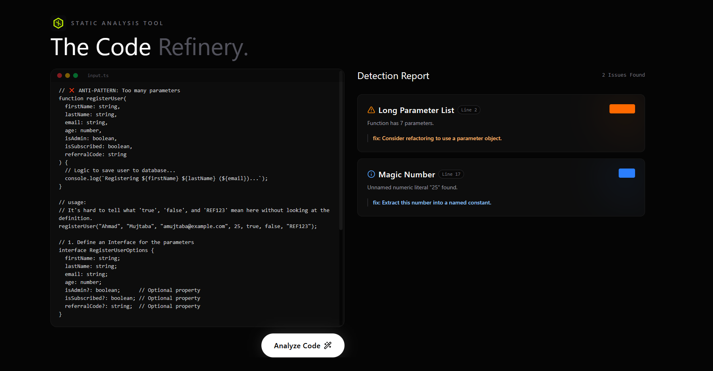

# The Code Refinery
**A Handcrafted TypeScript Static Analysis Tool**

> "Code should be as beautiful as it is functional."

The Code Refinery is a premium, design-forward static analysis tool built to detect common anti-patterns in TypeScript codebases. It combines powerful AST (Abstract Syntax Tree) parsing with a "Digital Craftsmanship" aesthetic—rejecting generic dashboards for a tactile, editorial user experience.



## ✨ Features

We go beyond simple linting. The Code Refinery deeply analyzes your source code to detect structural and logical "smells" that compromise maintainability:

1.  **Any Type Abuse**: Detects explicit usage of `any`, which defeats the purpose of TypeScript.
2.  **God Class**: Identifies classes that are doing too much (excessive methods/properties).
3.  **Long Parameter List**: Flags functions taking too many arguments (suggesting object destructuring).
4.  **Magic Numbers**: Spots unexplained numeric literals that should be named constants.
5.  **Callback Hell**: Detects excessive nesting of callbacks/functions (pyramid of doom).
6.  **Non-Null Assertions**: Flags usage of `!` which bypasses strict null checks.

## 🛠️ Tech Stack

Built with the latest edge-technologies for maximum performance and design control:

-   **Framework**: [Next.js 15](https://nextjs.org/) (App Router, Server Actions)
-   **Core**: [React 19](https://react.dev/)
-   **Language**: TypeScript 5
-   ** styling**: [Tailwind CSS v4](https://tailwindcss.com/) (Alpha) with custom "Midnight Void" theme.
-   **Animation**: [Framer Motion](https://www.framer.com/motion/) for complex micro-interactions (magnetic buttons, entrance sequences).
-   **Analysis Engine**: [TypeScript Compiler API](https://github.com/microsoft/TypeScript/wiki/Using-the-Compiler-API) for raw AST traversal.

## 🎨 Design Philosophy: "Digital Craftsmanship"

This project rejects the standard "Bootstrap/Material" look. Every pixel is intentional:

-   **Anti-Generic**: Editorial typography using **Playfair Display** (Headlines) and **Outfit** (UI/Body).
-   **Tactile Depth**: Glassmorphism (`backdrop-blur`), subtle inner borders, and deep void backgrounds (`#050505`).
-   **Motion Design**: Elements don't just appear; they drift, fade, and scale. The "Analyze" button features a magnetic hover effect and a scanning liquid light animation.
-   **Colors**: A high-contrast palette pairing **Midnight Void** (Backgrounds) with **Electric Lime** (Accents).

## 🚀 Getting Started

### Prerequisites
- Node.js 18+
- npm or pnpm

### Installation

1.  Clone the repository:
    ```bash
    git clone https://github.com/yourusername/typescript-anti-patterns.git
    cd typescript-anti-patterns
    ```

2.  Install dependencies:
    ```bash
    npm install
    # or
    pnpm install
    ```

3.  Run the development server:
    ```bash
    npm run dev
    ```

4.  Open [http://localhost:3000](http://localhost:3000) in your browser.

## 📂 Project Structure

```
src/
├── app/
│   ├── actions.ts       # Server Actions (Bridge between UI and AST logic)
│   ├── page.tsx         # Main UI (Input & Results Dashboard)
│   ├── layout.tsx       # Root Layout & Font Configuration
│   └── globals.css      # Design System & Tailwind v4 Theme
├── components/
│   ├── CodeInput.tsx    # Syntax-aware input area
│   └── PatternCard.tsx  # Result visualization cards
├── lib/
│   └── analyzer.ts      # Core AST Analysis Logic (The Brain)
└── scripts/
    └── test-analyzer.ts # CLI test script for validation
```

## 🔍 How It Works

1.  **Input**: You paste TypeScript code into the editor.
2.  **Processing**: The code is sent to a Server Action (`analyzeSourceCode`).
3.  **AST Traversal**: We create a temporary in-memory TypeScript `SourceFile`.
4.  **Pattern Matching**: We traverse the nodes (AST) looking for specific syntax kinds (e.g., `ts.SyntaxKind.AnyKeyword`, `ts.SyntaxKind.NumericLiteral`).
5.  **Report**: A list of `AntiPatternResult` objects is returned to the client and rendered as beautiful, actionable cards.

---

*Est. 2025. Crafted with precision.*
